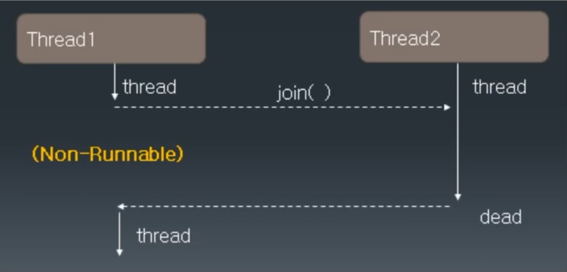

# Thread 클래스의 여러 메서드들

## Thread 우선 순위

- Thread.MIN_PRIORITY(=1) ~ Thread.MAX_PRIORITY(=10)
- 디폴트 우선 순위: Thread.NORMAL_PRIORITY(=5)
- 우선 순위가 높은 Thread가 CPU의 배분을 받을 확률이 높다.
- setPriority()/getPriority()
- Thread 우선 순위 예제

```java
class PriorityThread extends Thread {
    public void run() {
        int sum = 0;
        Thread t = Thread.currentThread();
        System.out.println(t + "start");

        for (int i = 0; i <= 1000000; i++) {
            sum += i;
        }

        System.out.println(t.getPriority() + "end");
    }
}

public class PriorityTest {
    public static void main(String[] args) {
        int i;
//        for (i = Thread.MIN_PRIORITY; i <= Thread.MAX_PRIORITY; i++) {
//            PriorityThread pt = new PriorityThread();
//            pt.setPriority(i);
//            pt.start();
//        }

        PriorityThread pt1 = new PriorityThread();
        PriorityThread pt2 = new PriorityThread();
        PriorityThread pt3 = new PriorityThread();

        pt1.setPriority(Thread.MIN_PRIORITY);
        pt2.setPriority(Thread.NORM_PRIORITY);
        pt3.setPriority(Thread.MAX_PRIORITY);

        pt1.start();
        pt2.start();
        pt3.start();
        
        // 결과
        // Thread[Thread-1,5,main]start
        // Thread[Thread-0,1,main]start
        // Thread[Thread-2,10,main]start
        // 10end
        // 5end
        // 1end
    }
}
```

## join()

- 동시에 두 개 이상의 Thread가 실행될 때 다른 Thread의 결과를 참조하여 실행해야하는 경우 join() 함수를 사용
- join() 함수를 호출한 Thread가 not-runnable 상태가 감
- 다른 Thread의 수행이 끝나면 runnable 상태로 돌아옴



- 1부터 50, 51부터 100까지의 합을 구하는 두 개의 Thread를 만들어 그 결과를 확인해 보세요.

```java
public class JoinTest extends Thread {
    int start;
    int end;
    int total;

    // 생성자
    public JoinTest(int start, int end) {
        this.start = start;
        this.end = end;
    }

    public void run() {
        int i;
        for (i = start; i <= end; i++) {
            total += i;
        }
    }

    public static void main(String[] args) {
        // main 쓰레드가 필요한 값은 lastTotal 값이 필요하다. 하지만 jt1과 jt2의 쓰레드 결괏값을 main이 기다려 주지 않는다.
        // 그래서 join()을 걸어준다.
        JoinTest jt1 = new JoinTest(1, 50);
        JoinTest jt2 = new JoinTest(51, 100);

        jt1.start();
        jt2.start();

        // jt1과 jt2의 쓰레드에 join() 함수를 걸어주는데 jt1과 jt2의 쓰레드가 끝나지 않을 수도 있기 때문에 예외 처리를 해야 한다.
        try {
            jt1.join();
            jt2.join();
        } catch (InterruptedException e) {
            e.printStackTrace();
        }

        int lastTotal = jt1.total + jt2.total;

        System.out.println("jt1.total = " + jt1.total);
        System.out.println("jt2.total = " + jt2.total);
        System.out.println("lastTotal = " + lastTotal);

        // 결과
        // jt1.total = 1275
        // jt2.total = 3775
        // lastTotal = 5050
    }
}
```

## interrupt()

- 다른 Thread에 예외를 발생시키는 interrupt를 보낸다.
- Thread가 join(), sleep(), wait() 함수에 의해 not-nunnable 상태일 때 interrupt() 메서드를 호출하면 다시 runnable 상태가 될 수 있음.

## Thread 종료하기

- Thread를 종료할 때 사용함
- 무한 반복의 경우 while(flag)의 flag 변숫값을 false로 바꾸어 종료를 시킴
- 회사에서 서비스를 무한적으로 줘야할 때 무한 루프를 가지고 있는 쓰레드를 생성해서 서비스를 제공하고 종료해야 할 때에 while(flag)의 flag 변숫값을 false로 바꾸어 종료를 시킴
- Thread 종료하기 예제
    - 세 개의 thread를 만든다.
    - 각각 무한 루프를 수행하게 한다.
    - 작업 내용 this.sleep(100);
    - ‘A’를 입력 받으면 첫 번째 thread를
    - ‘B’를 입력 받으면 두 번째 thread를
    - ‘C’를 입력 받으면 세 번째 thread를
    - ‘M’을 입력 받으면 모든 thread와 main() 함수를 종료한다.

```java
import java.io.IOException;

public class TerminateThread extends Thread {
    private boolean flag = false; // while(flag)의 flag 변숫값

    // 생성자 (쓰레드 이름 설정)
    public TerminateThread(String name) {
        super(name);
    }

    public void run() {
        while (!flag) {
            try {
                sleep(100);
            } catch (InterruptedException e) {
                e.printStackTrace();
            }
        }

        System.out.println(getName() + " end");
    }

    // 종료
    public void setFlag(boolean flag) {
        this.flag = flag;
    }

    public static void main(String[] args) throws IOException {
        TerminateThread threadA = new TerminateThread("A");
        TerminateThread threadB = new TerminateThread("B");
        TerminateThread threadC = new TerminateThread("C");

        threadA.start();
        threadB.start();
        threadC.start();

        int in;
        while (true) {
            in = System.in.read();
            if (in == 'A') {
                threadA.setFlag(true);
            } else if (in == 'B') {
                threadB.setFlag(true);
            } else if (in == 'C') {
                threadC.setFlag(true);
            } else if (in == 'M') {
                threadA.setFlag(true);
                threadB.setFlag(true);
                threadC.setFlag(true);
                break;
            } else {
                System.out.println("Please enter a type");
            }
        }

        System.out.println("main end");

        // 결과
        // A
        // Please enter a type
        // A end
        // C
        // Please enter a type
        // C end
        // M
        // main end
        // B end
    }
}
```